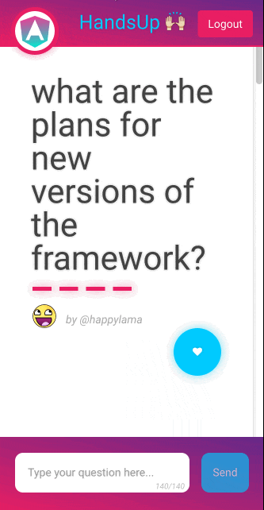

# handsup-react


[Live](https://handsup-63347.firebaseapp.com/#/)

Make your event more interactive allowing attendees to participate by adding questions and voting using their phone or laptop.

Organisers and speakers can use it to answer questions and run Q&A or panels sessions smoothly.

## Usage


## Development

If you have any questions feel free to ping me on [@gerardsans](http://twitter.com/gerardsans).

### Install

First, clone the repo via git:

```bash
$ git clone https://github.com/gsans/handsup-react.git
```

And then install dependencies:

```bash
$ cd cerebro && yarn && cd ./app && yarn && cd ../
```

### Run
```bash
$ yarn run dev
```

> Note: requires a node version >=6.x

## Technology stack

This application integrates the following technologies:
- [Auth0](http://auth0.com) to authenticate users using their social profiles (Google, Twitter)
- [Apollo Client](http://dev.apollodata.com) to communicate with GraphQL Server
- [graph.cool](http://graph.cool) providing the GraphQL Server

## Getting Started

In order to run this project you need to create the data model (schema) below using [graph.cool](http://graph.cool) console online and setup Auth0. 

### graphcool - HandsUp Schema

This is the schema used

```graphql
type Question {
  id: ID!
  body: String!
  votes: [Vote!]! @relation(name: "VoteOnQuestion")
  user: User @relation(name: "UserOnQuestion")
  createdAt: DateTime!
  updatedAt: DateTime!
}

type Vote {
  id: ID!
  question: Question @relation(name: "VoteOnQuestion")
  createdAt: DateTime!
  updatedAt: DateTime!
}

type User {
  auth0UserId: String
  id: ID!
  name: String
  username: String
  pictureUrl: String
  questions: [Question!]! @relation(name: "UserOnQuestion")
  role: USER_ROLE
  createdAt: DateTime!
  updatedAt: DateTime!
}
```

You can read the following blog as reference for an example as how you would create a schema from scratch
- [Setting up a GraphQL backend in 5 minutes](https://www.graph.cool/docs/tutorials/quickstart-1-thaeghi8ro)


### Auth0 + graphcool setup

In order to use Auth0 you need to do few steps. You can find some assistance by reading the articles below.

- [User Authentication with Auth0 for React and Apollo](https://www.graph.cool/docs/tutorials/react-apollo-auth0-pheiph4ooj)


## License
MIT © [Gerard Sans](https://github.com/gsans)